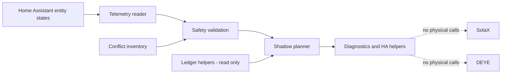

# Energy V2 – AppDaemon architektura pasivní fáze 1

Datum: 2026-07-26.

Tento dokument popisuje lokálně připravený, zatím nenasazený návrh AppDaemon aplikace `energy_v2`. Cílem první fáze je pouze shadow vyhodnocování a diagnostika. Aktivní řízení SolaXu a DEYE je záměrně neimplementované.

## 1. Aktuální instalační stav AppDaemonu

Zjištěno přes MCP:

- AppDaemon add-on je podle entity `update.appdaemon_aktualizovat` instalovaný.
- Instalovaná verze add-onu: `0.18.5`.
- `latest_version`: `0.18.5`.
- Stav update entity: `off`, tedy není dostupná aktualizace.

Neověřeno:

- zda add-on aktuálně běží,
- Python verze uvnitř AppDaemon add-onu,
- skutečná cesta AppDaemon konfigurace,
- obsah `/addon_configs/a0d7b954_appdaemon`,
- obsah `/config` a `/config/apps` uvnitř AppDaemon kontejneru,
- AppDaemon log.

Důvod: dostupné MCP nástroje ukazují pouze HA entity/služby a první úroveň YAML konfigurace Home Assistantu. Neposkytují bezpečné čtení ani zápis do AppDaemon add-on adresářů. Nebyly volány `hassio.addon_restart`, `hassio.addon_stdin` ani jiné služby add-onu.

## 2. Umístění konfiguračních souborů

Lokálně připravené soubory v pracovním prostoru:

- `apps/energy_v2/__init__.py`
- `apps/energy_v2/app.py`
- `apps/energy_v2/config.py`
- `apps/energy_v2/models.py`
- `apps/energy_v2/telemetry.py`
- `apps/energy_v2/planner.py`
- `apps/energy_v2/safety.py`
- `apps/energy_v2/diagnostics.py`
- `apps/energy_v2.yaml`
- `config/packages/energy_v2_helpers.yaml`

Tyto soubory nejsou nasazené do Home Assistantu ani do AppDaemon add-onu.

`configuration.yaml` načtený přes MCP neobsahoval `homeassistant: packages`, proto helper package nebyl zapisován do `/config/packages`.

## 3. Verze

- Home Assistant: `2026.7.4`.
- AppDaemon add-on: `0.18.5` podle update entity.
- Lokální Python pro testy: `C:\Python314\python.exe`.
- Python uvnitř AppDaemon add-onu: neověřeno.

## 4. Seznam souborů aplikace

| Soubor | Účel |
|---|---|
| `apps/energy_v2/__init__.py` | package marker |
| `apps/energy_v2/models.py` | dataclasses a enum režimů |
| `apps/energy_v2/config.py` | centrální mapa entit, znaménkové konvence, seznam aktuátorů a konfliktů |
| `apps/energy_v2/telemetry.py` | bezpečné čtení a parsování stavů |
| `apps/energy_v2/safety.py` | čisté validační funkce |
| `apps/energy_v2/planner.py` | čistý shadow planner |
| `apps/energy_v2/diagnostics.py` | formátování diagnostických výstupů |
| `apps/energy_v2/app.py` | AppDaemon wrapper, listen_state, heartbeat, diagnostické zápisy |
| `apps/energy_v2.yaml` | nenasazený návrh AppDaemon configu |
| `config/packages/energy_v2_helpers.yaml` | nenasazený návrh HA helperů |

## 5. Seznam čtených entit

| Klíč | Entity |
|---|---|
| `solax_soc` | `sensor.solax_battery_capacity` |
| `solax_battery_power` | `sensor.solax_battery_power_charge` |
| `solax_pv_power` | `sensor.solax_pv_power_total` |
| `solax_house_load` | `sensor.solax_house_load` |
| `solax_grid_import` | `sensor.solax_grid_import` |
| `solax_grid_export` | `sensor.solax_grid_export` |
| `deye_soc` | `sensor.deye_battery` |
| `deye_battery_power` | `sensor.deye_battery_power` |
| `deye_battery_state` | `sensor.deye_battery_state` |
| `deye_grid_power` | `sensor.deye_grid_power` |
| `deye_external_power` | `sensor.deye_external_power` |
| `deye_device_state` | `sensor.deye_device_state` |
| `deye_connection` | `binary_sensor.deye_connection` |
| `buy_price` | `sensor.current_buy_electricity_price_15min` |
| `sell_price` | `sensor.current_sell_electricity_price_15min` |
| `future_sell_rank` | `sensor.energy_trading_budouci_poradi_prodejni_ceny` |
| `deye_grid_charging` | `switch.deye_battery_grid_charging` |
| `deye_export_surplus` | `switch.deye_export_surplus` |
| `legacy_enabled` | `input_boolean.energy_trading_puvodni_reseni_povoleno` |
| `current_energy_trading_enabled` | `input_boolean.energy_trading_novy_system_povolen` |
| `energy_v2_deye_fv_ledger` | `input_number.energy_v2_deye_fv_ledger` |
| `energy_v2_solax_fv_ledger` | `input_number.energy_v2_solax_fv_ledger` |

## 6. Budoucí vlastněné aktuátory

Energy V2 fáze 1 je pouze sleduje a loguje externí změny. Nezapisuje do nich.

- `select.solax_charger_use_mode`
- `select.solax_manual_mode_select`
- `number.solax_battery_discharge_max_current`
- `number.solax_battery_charge_max_current`
- `number.solax_remotecontrol_active_power`
- `number.solax_remotecontrol_autorepeat_duration`
- `select.solax_remotecontrol_power_control`
- `button.solax_remotecontrol_trigger`
- `select.deye_work_mode`
- `select.deye_time_of_use`
- `select.deye_ac_coupling`
- `switch.deye_export_surplus`
- `switch.deye_battery_grid_charging`
- `number.deye_grid_max_export_power`
- `number.deye_export_surplus_power`
- `number.deye_grid_max_import_power`
- `number.deye_battery_grid_charging_current`

## 7. Konfliktní automatizace

Konfigurované konflikty:

- `automation.fve_solax_zpet_do_self_use_po_vybiti_deye`
- `automation.rizeni_solaxu_podle_kalendare_nakup`
- `automation.rizeni_solaxu_podle_kalendare_prodej`
- `automation.deye_rizeni_baterie_dle_ceny_nabijeni_vybijeni`
- `automation.gridcontrol_charge`
- `automation.spust_vybijeno_deye_v_konkretni_cas`
- `automation.vypne_vybijeni_deye_a_zapne_self_use_mod_na_solaxu`
- `automation.zpnout_nabijeni_deye_v_ucity_cas`

Při auditu byla aktivní:

- `automation.fve_solax_zpet_do_self_use_po_vybiti_deye`

## 8. Datový tok



## 9. Stavový model

`Mode` v `models.py`:

- `DISABLED`
- `IDLE`
- `PV_CHARGE_DEYE`
- `EXPORT_DEYE`
- `EXPORT_SOLAX`
- `FAULT`
- `SERVICE`

Helper návrh:

- `input_select.energy_v2_requested_mode`
- `input_select.energy_v2_actual_mode`

V první fázi zůstává skutečný režim vždy `DISABLED`. Planner může pouze doporučit požadovaný režim.

## 10. Shadow planner

Čistá funkce:

```python
plan_shadow_mode(...)
```

Logika:

1. nevalidní telemetrie → `FAULT`,
2. DEYE ledger + povolený export + vysoká cena/rank + SOC nad minimem → `EXPORT_DEYE`,
3. SolaX ledger + povolený export + vysoká cena/rank + SOC nad minimem → `EXPORT_SOLAX`,
4. konzervativní FV přebytek + SolaX SOC nad startem + DEYE SOC pod maximem + grid charging off → `PV_CHARGE_DEYE`,
5. jinak `IDLE`.

Konzervativní přebytek:

```python
pv_surplus_w = solax_pv_power_w - max(solax_house_load_w, 0.0)
```

Záporný `sensor.solax_house_load` tedy nezvyšuje přebytek.

## 11. Bezpečnostní omezení fáze 1

Aktivní řízení SolaXu: neimplementováno

Aktivní řízení DEYE: neimplementováno

PV Charge: pouze doporučení

Export DEYE: pouze doporučení

Export SolaX: pouze doporučení

Ledger: pouze připravené helpery, bez automatické aktualizace

Grid Charge: neimplementován a nebude součástí obchodního systému

Metoda:

```python
def execute_mode(self, mode: Mode) -> None:
    raise RuntimeError("Physical control is intentionally disabled in Energy V2 phase 1")
```

není nikde volaná.

Aplikace zapisuje pouze do nových diagnostických helperů:

- `input_select.energy_v2_requested_mode`
- `input_select.energy_v2_actual_mode`
- `input_text.energy_v2_last_fault`
- `input_text.energy_v2_last_decision`
- `input_text.energy_v2_active_conflicts`
- `input_datetime.energy_v2_heartbeat`

Při nebezpečném zapnutí může vypnout pouze vlastní `input_boolean.energy_v2_enabled`.

Do ledger helperů nezapisuje.

## 12. Známé nejasnosti

1. AppDaemon souborový systém nebyl dostupný přes MCP.
2. Nebylo ověřeno, zda AppDaemon add-on běží.
3. Nebyla ověřena Python verze uvnitř add-onu.
4. Nebyl ověřen AppDaemon log.
5. Node-RED flow nebylo dostupné, takže další zápisové cesty nelze vyloučit.
6. HA helper package nebyl nasazen, protože `configuration.yaml` neobsahuje aktivní packages.

## 13. Další implementační krok

Společný audit vytvořeného AppDaemon kódu, shadow rozhodnutí a inventáře konfliktů před implementací ledgeru DEYE.

